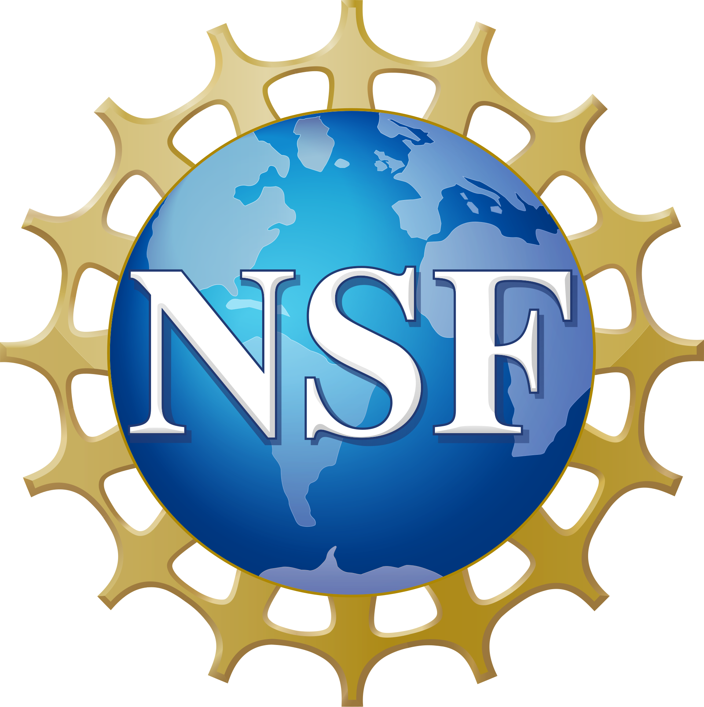
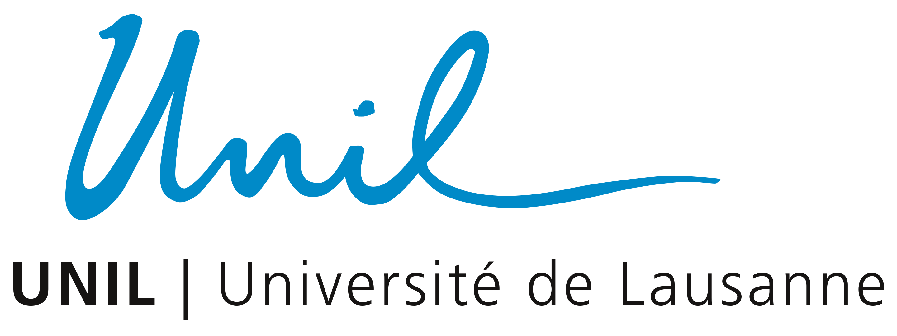

# Fiber ODF estimation with a deep neural network

This code contains the code for the papers:

- [Deep learning microstructure estimation of developing brains from diffusion MRI: a newborn and fetal study](https://www.sciencedirect.com/science/article/pii/S1361841524001117) by Hamza Kebiri, Ali Gholipour, Rizhong Lin, Lana Vasung, Camilo Calixto, Željka Krsnik and Davood Karimi\*, Meritxell Bach Cuadra\* (\*: Equal contribution), Medical Image Analysis 2024; and
- [Robust Estimation of the Microstructure of the Early Developing Brain Using Deep Learning](https://link.springer.com/chapter/10.1007/978-3-031-43990-2_28) by Hamza Kebiri, Ali Gholipour, Rizhong Lin, Lana Vasung and Davood Karimi\*, Meritxell Bach Cuadra\* (\*: Equal contribution), MICCAI 2023

## Structure

- `fod_cnn_genData.py` to generate the input data, ground truth data and CSD baseline from dHCP data
- `fod_cnn_train.py` to train the CNN to learn FOD predictions from input data
- `fod_cnn_test.py` to test the CNN
- `fod_cnn_genDataGS.py` to generate the two gold standards (GS1 and GS2)
- `dk_aux.py`, `dk_model.py`, `crl_aux.py` and `dk_seg.py` include auxiliary functions (developed by [Davood Karimi](mailto:davood.karimi@childrens.harvard.edu)) that are used by the scripts above.
- `MLP` folder contains TrainMLP.py to train the MLP model of Karimi et al., Neuroimage, 2021
- `CTtrack` folder contains the code of Hosseini et al., Neuroscience Informatics, 2022

Please note that the network code has been reimplemented by [Rizhong Lin](mailto:rizhong.lin@epfl.ch) with a newer version of TensorFlow [here](https://github.com/Medical-Image-Analysis-Laboratory/dl_fiber_domain_shift/tree/main/DeepLearning/kebiri_robust_2023) and PyTorch [here](https://github.com/Medical-Image-Analysis-Laboratory/dl_fiber_domain_shift/tree/main/DeepLearning/kebiri_robust_2023_pytorch).

## Data

The data used in this study are from the publicly available dataset of the [Developing Human Connectome Project (dHCP)](https://www.humanconnectome.org/study/lifespan-developing-human-connectome-project), and two private datasets of fetal and neonatal MRI scans.

## Acknowledgements

<table align="center" width="100%">
  <tr align="center">
    <td width="20%"></td>
    <td width="20%"></td>
    <td width="10%"></td>
    <td width="10%"></td>
  </tr>
</table>

<table align="center" width="100%">
  <tr align="center">
    <td width="30%"></td>
    <td width="15%"></td>
    <td width="20%"></td>
    <td width="20%"></td>
    <td width="20%"></td>
  </tr>
</table>

We gratefully acknowledge the CIBM Center for Biomedical Imaging (Centre d'Imagerie BioMédicale), a Swiss research center of excellence supported by Lausanne University Hospital (CHUV), University of Lausanne (UNIL), École Polytechnique Fédérale de Lausanne (EPFL), University of Geneva (UNIGE), Geneva University Hospitals (HUG), and the Leenaards and Jeantet Foundations.

This research was supported by grants from the Swiss National Science Foundation (grant 182602); the National Institutes of Health (NIH), including the National Institute of Biomedical Imaging and Bioengineering (R01HD110772, R01EB031849, R01EB032366), the National Institute of Neurological Disorders and Stroke (R01NS128281, R01NS106030), and the Eunice Kennedy Shriver National Institute of Child Health and Human Development (R01HD109395); the NIH Office of the Director (S10OD025111); the National Science Foundation (NSF) (grant 212306); and the Croatian Science Foundation (grant IP-2022-10-5975). This work was also supported by NVIDIA Corporation and utilized NVIDIA RTX A6000 and RTX A5000 GPUs.

## Citation

If you find our work useful in your research, please consider citing:

```bibtex
@article{kebiri_deep_2024,
  title   = {Deep learning microstructure estimation of developing brains from diffusion {MRI}: A newborn and fetal study},
  url     = {https://www.sciencedirect.com/science/article/abs/pii/S1361841524001117},
  doi     = {10.1016/j.media.2024.103186},
  author  = {Kebiri, Hamza and Gholipour, Ali and Lin, Rizhong and Vasung, Lana and Calixto, Camilo and Krsnik, Željka and Karimi, Davood and Bach Cuadra, Meritxell},
  year    = {2024},
  month   = jul,
  journal = {Medical Image Analysis},
  volume  = {95},
  pages   = {103186},
  issn    = {1361-8415},
}

@inproceedings{kebiri_robust_2023,
  title     = {Robust {Estimation} of the {Microstructure} of the {Early} {Developing} {Brain} {Using} {Deep} {Learning}},
  url       = {http://link.springer.com/chapter/10.1007/978-3-031-43990-2_28},
  doi       = {10.1007/978-3-031-43990-2_28},
  author    = {Kebiri, Hamza and Gholipour, Ali and Lin, Rizhong and Vasung, Lana and Karimi, Davood and Bach Cuadra, Meritxell},
  year      = 2023,
  month     = oct,
  booktitle = {26th {International} {Conference} on {Medical} {Image} {Computing} and {Computer} {Assisted} {Intervention} -- {MICCAI} 2023},
  pages     = {293--303}
}

@inproceedings{lin_cross-age_2024,
  title     = {Cross-{Age} and {Cross}-{Site} {Domain} {Shift} {Impacts} on {Deep} {Learning}-{Based} {White} {Matter} {Fiber} {Estimation} in {Newborn} and {Baby} {Brains}},
  doi       = {10.48550/arXiv.2312.14773},
  author    = {Lin, Rizhong and Gholipour, Ali and Thiran, Jean-Philippe and Karimi, Davood and Kebiri, Hamza and Bach Cuadra, Meritxell},
  year      = 2024,
  month     = may,
  booktitle = {21st {IEEE} {International} {Symposium} on {Biomedical} {Imaging} ({ISBI})}
}
```

## Contact

If you have any questions, please feel free to contact [Hamza Kebiri](mailto:hamza.kebiri@unil.ch).
